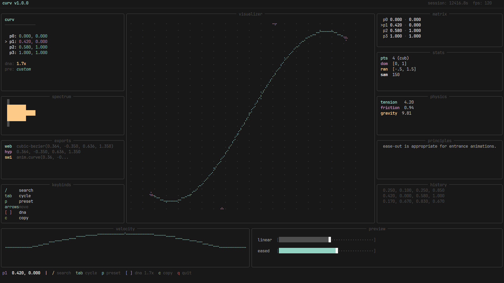

# 📈 curv



*terminal **bezier curve** workstation.*

## installation

install:

```bash
pip install git+https://github.com/programmersd21/curv.git
```

## usage

start the workstation:

```bash
curv
```

### controls

| key | action |
|-----|--------|
| / | open searchable preset explorer |
| tab / shift+tab | cycle selection forwards or backwards (p0, p1, p2, p3) |
| arrows | move selected point (0.05 units) |
| shift + arrows | move selected point (0.005 units) |
| [ / ] | adjust dna intensity multiplier (0.1x - 3.0x) |
| a | toggle animation preview |
| c | copy css configuration to clipboard |
| h | toggle technical help |
| q | quit |

## technical features

### 120 fps engine
non-blocking high-precision render loop providing real-time feedback for all curve mutations and physics simulations.

### responsive multi-panel layout
highly adaptable technical workspace that degrades gracefully on smaller terminals while maintaining zero-gap coverage and information density.

### analytical components
- visualizer: continuous column-by-column braille curve rasterization with dynamic crosshairs.
- velocity: dy/dx momentum graph for transition punchiness analysis.
- spectrum: momentum distribution across animation segments.
- matrix: real-time coordinate readout for all control points.
- physics: simulated mechanical properties derived from the curve (tension, friction).
- dna intensity: real-time multiplier that dynamically scales control points away from center for extreme visual exaggeration.
- history: breadcrumb trail of previous coordinate states.

## export formats

### css
```css
cubic-bezier(0.420, 0.000, 0.580, 1.000)
```

### hyprland
```text
0.420, 0.000, 0.580, 1.000
```

### swiftui
```swift
animation.timingcurve(0.420, 0.000, 0.580, 1.000)
```

## license

mit
